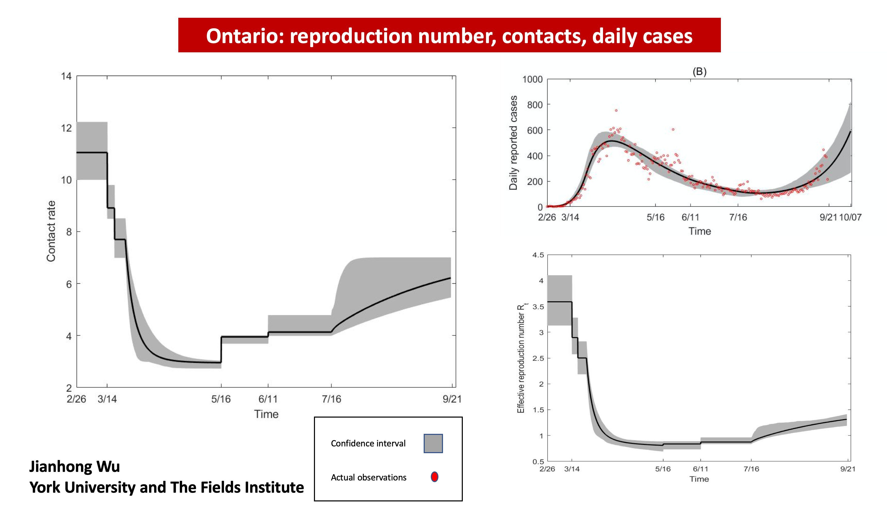
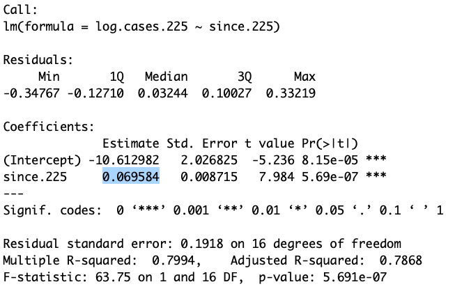

# Tues Sept 29: Doubling time

DUE DATE: Thurs Oct 8

Today we will make a graph of the current COVID-19 data for Ontario. When only a small fraction of the population is resistant to an infection, the number of daily cases, in absence of any interventions such as physical distancing, is expected to grow exponentially over time. At the end of this exercise you will have calculated the doubling time for the second wave of COVID-19 in Ontario.

Visit the website: https://art-bd.shinyapps.io/covid19canada/, this site is the _front end_ for the data we will use which are archived [here](https://github.com/ishaberry/Covid19Canada) (also referred to as the _back end_). These data can easily be pulled into `R` using this command:

```{r,eval=T}
COVID.data <- data.table::fread('https://raw.githubusercontent.com/ishaberry/Covid19Canada/master/timeseries_prov/active_timeseries_prov.csv', fill = TRUE)
```

However, first you will need to install the `data.table` package:
```{r,eval=F}
install.packages("data.table")
```

When asked: _Do you want to install from sources the package which needs compilation? (Yes/no/cancel)_ enter `no`.

To view the data type:

```{r,eval=T}
head(COVID.data)
```

`head()` is a command that shows the first 6 lines of the quantity inside the round brackets. `COVID.data` is a very large table of data. If I type `COVID.data` into the Console I will get more information than I want, so I instead use `head()`.

So far we have pulled data from an online repository. However, it is good practice to save these data in case later the repository is removed. We can make copy of the data for our records using the following commands:

```{r,eval=F, echo=F}
write.csv(COVID.data,"/Users/amyhurford/Desktop/BIOL-3295-Fall-2020/COVID-data-save.csv")
```

Note that the above contains the path to folders on my computer and saves `COVID.data` as the file _COVID-data-save.csv_. You will need to replace the path above with correct path to the folder on your own computer where you want to save these data. Setting the path is computer-specific, and so we always have problems with this in class because the solutions vary by student. Some tricks that work for me are:

 - type `getwd()` into the Console. This will tell you the current working directory and can give you clues on the format of the path for your computer.
 
 - clicking the `Source` button on a .R file that you have made will print the path to that .R file into the Console. 
 
 - elect to save the file somewhere very simple, for example, on your Desktop and then move it to a more organized place later.
 
Navigate to the folder where you expected to save the data as a .csv file. You should be able to open the .csv file in _Microsoft Excel_. [THIS PART DOESN'T WORK - SORRY - JUST SKIP]

Now, the data table `COVID.data` contains data for all provinces and we would like to _subset_ the data so that only the information pertaining to Ontario is left. We do this as follows:

```{r,eval=T}
data.ON <- COVID.data[province == "Ontario"]
```

We should understand what variables are contained in our data set. Query the following in your Console:

```{r,eval=FALSE}
colnames(data.ON)
```

We will plot confirmed positive cases over time:

```{r,eval=TRUE}
plot(data.ON$cumulative_cases, ylab = "Cumulative cases", typ = "l")
```

Note that we haven't provided an x-axis argument above. The x-axis should be `date_active`, however, from our previous exercise (Chapter \@ref(PE2)), we recognize that dates need to be reformatted to be an appropriate x-axis.

```{r, eval=T}
head(data.ON$date_active)
```

The earliest date is January 25, 2020. We will use this as the origin and calculate the number of days since that time.

```{r, eval=T}
require(chron)
days.since <- julian(as.Date(data.ON$date_active, format = "%d-%m-%Y"),origin=as.Date("25-01-2020", format = "%d-%m-%Y"))
```

If you get an error this may be because you have not installed the `chron` package. You can do so as `install.packages("chron")`.

On my first attempt at the above code, I tried `julian(data.ON$date_active)`. This generated an error because our dates from the COVID-19 dataset are formatted as a character string "01-25-2020", but the `julian()` function is expecting three numerical arguments `julian(m,d,y)`. As such, `julian(data.ON$Date`) fails to provide three numerical arguments to the function and instead provides a single character string. For this reason the function `as.Date()` needs to be applied to `data.ON$Date` inside the `julian()` function.

We now have a quantity `days.since` that is appropriate for the x-axis of our graph:

```{r,eval=TRUE}
plot(days.since, data.ON$cumulative_cases, ylab = "cumulative cases", xlab = "days since Jan 25, 2020", typ = "l")
```

However, rather than calculating cumumlative cases suppose that we might like to plot daily new cases. We do this by subtracting the cumulative cases for the previous day. The function `diff()` subtracts the element previous to the entry of a list and because the first element of the list has not preceeding value we add in a 0.

```{r,eval=TRUE}
new.cases <- diff(c(0,data.ON$cumulative_cases))
plot(days.since, new.cases, ylab = "new cases", xlab = "days since Jan 25, 2020", typ = "l")
```

If we have done a good job of our work, it should be consistent with the official graph labelled as (B) below:

```{r ONData, echo=FALSE, out.width="120%", purl=FALSE}

```

We can also focus in on just the second wave by adjusting the `xlim` argument:

```{r,eval=TRUE}
plot(days.since[200:max(days.since)], new.cases[200:max(days.since)], ylab = "new cases", xlab = "days since Jan 25, 2020", pch = 16)
```

Note that the second wave of COVID-19 in Ontario appears to be consistent with exponential growth. Recall that when the y-axis of the graph is on a logarithmic scale, exponential growth will be represented as a straight line.

```{r doublingtime2, echo=FALSE, fig.cap="Straight lines illustrate exponential growth with different doubling times when the y-axis is plotted on a logarithmic scale", out.width="95%", purl=FALSE}
knitr::include_graphics("figures/doublingtime.jpg")
```

We can estimate the doubling time of the number of new cases for the second wave of COVID-19 in Ontario by perfoming a linear regression on the natural logarithm of the number of new cases. Below, we consider only the data 224 days after January 25 and onwards. The function `lm()` performs the linear regression and `abline()` plots the regression.

```{r,eval=TRUE}
since.225 <- days.since[225:max(days.since)]
log.cases.225 <- log(new.cases[225:max(days.since)])
plot(since.225,log.cases.225, ylab = "log(new cases)", xlab = "days since Jan 25, 2020", pch = 16)
reg <- lm(log.cases.225~since.225)
abline(reg)
summary(reg)
```

From the summary of the linear regression we are interested in the slope, because in the previous class we estimated the relationship between this slope and the doubling time.

```{r regression, echo=FALSE, fig.cap="The above output shows the slope of the regression as 0.0695 log cases per day", out.width="95%", purl=FALSE}

```

## Questions
1. How many observations and how many variables are there in the `COVID.data` and the `data.ON` files? (see the _Environment_ tab) [1 mark]

2. What command did you use to save the data as a .csv file? - IGNORE THIS QUESTION - INSTRUCTIONS WERE BAD [1 mark]

3. What do you estimate the doubling time of the second wave of COVID-19 in Ontario to be? Show your calculations [3 marks]

4. Write an R Script that performs the linear regression as illustrated above. Your script must make the figure including the regression line [7 marks] 
