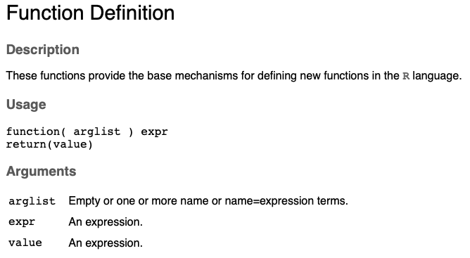

# Tues Oct 6: Solving the logistic growth equation using a computer 1 {#NumSolve1}

ANNOUNCEMENT: Friday Oct 2 is a catch-up day

DUE DATE: Tues Oct 13

Recall that for continous time exponential growth there were two ways that the equation might be written. Firstly, as a _change_ in population size over time,

\begin{equation}
\frac{dN(t)}{dt} = rN(t),
(\#eq:Exp1)
\end{equation}

such that if $\frac{dN(t)}{dt}>0$, the population size, $N(t)$ is increasing over time, and if $\frac{dN(t)}{dt}<0$, the population size is decreasing over time. Alternatively, we can write continuous time exponential growth as,

\begin{equation}
N(t) = N(0)e^{rt},
(\#eq:Exp2)
\end{equation}

where the lefthand side of equation \@ref(eq:Exp2) states the _size_ of the population, $N(t)$, at time $t$, rather than the _change_ in the size of the population, as it did in equation \@ref(eq:Exp1). 

For logistic growth, we have:

\begin{equation}
\frac{dN(t)}{dt} = rN(t)\left(1 - \frac{N(t)}{K} \right).
(\#eq:Log1)
\end{equation}

How might we find the equivalent of equation \@ref(eq:Exp2) for logistic growth? i.e., for logistic growth, what is the equation for the _size_ of the population at a particular time, $t$? If you are great at math, you might integrate equation \@ref(eq:Log1) using [separation of variables](https://math.usu.edu/~powell/ysa-html/node8.html). However, another option, that we will build towards for next class, is to numerically integrate equation \@ref(eq:Log1) using a computer.


## What is an ordinary differential equation?
In an introductory calculus course that covers integration, most often you are solving problems of the type:

\begin{eqnarray}
\frac{dy(x)}{dx} &=& x^2, \\
\int \frac{dy(x)}{dx} &=& \int x^2 \ dx, \\
y(x) &=& \frac{1}{3}x^3 + c.
(\#eq:e1)
\end{eqnarray}

Note that in the above calculations, we are able to use integration to find $y(x)$ when we are given the rate of change equation, $\frac{dy(x)}{dx}$. In the above equations, $x$, is the independent variable, $y(x)$ is the dependent variable, the derivative of $y(x)$ is with respect to $x$, and $x$ appears on the opposite side of the `=` to the derivative of the dependent variable. In the notation of population biology, where $N(t)$ is conventional for the dependent variable, a similar problem might look like this:

\begin{eqnarray}
\int \frac{dN(t)}{dt} &=& \int rt \ dt, \\ \nonumber
N(t) &=& \frac{1}{2}rt^2 + c. 
(\#eq:e2)
\end{eqnarray}

We have not seen any equations like equation \@ref(eq:e2) in BIOL 3295 so far: usually, our equations for the _change_ in the population size, $\frac{dN(t)}{dt}$, have a dependency on the population size, $N(t)$ (the dependent variable), rather than a sole dependency on $t$ (the independent variable).

The equations that are models for population biology are sometimes ODEs. While some ODEs can be solved using math, commonly the ODEs that are used to model population dynamics need to be integrated numerically; that is, using a computer. 

## Numerically integrating an ordinary differential equation in R

Numerical integration in `R` can be performed by installing this package:

```{r, eval=F}
install.packages("deSolve")
```

To integrate our ODE, we use the function `ode()` from the `deSolve` package. Let's look at the structure of this function. The mandatory arguments to the function are:

`ode(y,times,parms,func)`

where,

`y` is a vector of the initial values of the dependent variable (i.e., those which correspond to the initial time).

`times` is a sequence of time points that we will calculate the values of the variables; the first value of times is the initial time.

`func` is a function that computes the values of the derivatives of the dependent variables. `func` must be defined as: `func <- function(t, y, parms,...)`. `t` is the current time point in the integration, and `y` is the current estimate of the variables in the ODE system.

Given what we have learned in BIOL 3295 so far, `y` and `times` are not so tricky, but the `func` arguement requires us to write our own function, and so far we have only used functions written by other people: we have yet to write our own custom functions. In preparation for next class, when we will numerically integrate the logistic growth equation, we will next learn how to write custom functions.

## Writing custom functions
Generally, your code can still work without writing custom functions, however writing functions makes your code modular and more organized.

Consider the following code:

```{r, eval=F}
# Temperatures in Celcius
temp.min.C <- 10
temp.max.C <- 20

# Temperatures in Farenheit
temp.min.F <- temp.min.C*9/5+32
temp.max.F <- temp.max.C*9/5+32 
```

The above code is fine, but since the same calculation is performed twice (conversion of Celcius to Farenheit), just with a different number, we might consider writing a custom function. Let's re-write the above code so that it now uses a custom function:

```{r, eval=F}
# A function that converts Celcius to Farenheit
C.to.F <- function(C){
  F <- C*9/5 +32
  return(F)
}

# Temperatures in Celcius
temp.min.C <- 10
temp.max.C <- 20

# Temperatures in Farenheit
temp.min.F <- C.to.F(temp.min.C)
temp.max.F <- C.to.F(temp.max.C)
```

Note that the above code consists of the _function definition_ and the _function call_. The function definition uses the function `function()`.

```{r function, echo=FALSE, out.width="120%", purl=FALSE}

```

In the example, note the following:

- `arglist` is just one value: `C`. Generally, several values might be provided to the function where each should be separated by commas and enclosed within the `()`.

- `expression` can be any set of commands and should be enclosed within the `{}`.

- The function is assigned a name: `C.to.F`. We give the function a name so that we can use it later during a function call.

## Questions
1. The following is an equation for exponential population growth with a constant immigration rate, $m>0$, into the population:

\[
\frac{dN(t)}{dt}= rN(t) + m
\]

where $r$ is the net reproductive rate, and $N(t)$ is the population size at time, $t$.

Is this equation an ordinary differential equation (ODE)? Give 1 sentence explaining your reasoning [2 marks].

2. Write a function that adds 123 to a user supplied argument, and then write the line of code that calls the function to evaluate 123+1, and assigns the result the variable name `y`. You are to hand in your R script. [5 marks]
