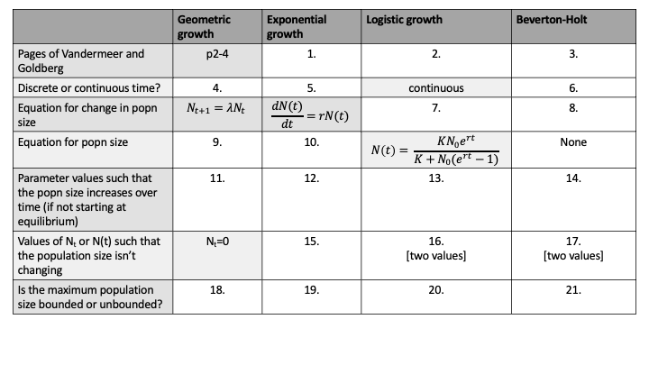

# MIDTERM

DUE DATE: Thurs March 3 at 9am

## Chapter 1 in Vandermeer and Goldberg

Vandermeer, J.H., Goldberg, D.E., 2013. Population Ecology: First Principles (Second Edition). Princeton University Press, Princeton, United States. Chapter 1. [Link](https://ebookcentral-proquest-com.qe2a-proxy.mun.ca/lib/mun/detail.action?docID=1205619)

Complete the table below by providing a response in all locations where there is **a number in a box**. Some of the table has already been completed to give you an idea of how to answer the questions. [21 marks]

```{r midterm, echo=FALSE, out.width="120%", purl=FALSE}

```

## Chapter 6 in Sherratt and Wikinson

Chapter 6. _Is Nature Chaotic_ of Big problems in ecology and evolution by Sherratt and Wilkinson. [Link](https://ebookcentral.proquest.com/lib/mun/reader.action?docID=430616&ppg=136) 

1. What is chaos? [1 mark]

1. Write down a population model that produces chaos? Define all the parameters and variables in the model. [4 marks]

1. For the population model from your previous answer, for what values of the parameters does chaos occur? [1 mark]

1. What is the butterfly effect? [1 mark]

1. Give one example of a laboratory experiment that showed evidence of chaos. List one limitation of this experiment. Provide the full citation. [3 marks]

1. Give one natural (non-laboratory) example of a population that may show chaotic dynamics. List one limitation of this study. Provide the full citation. [3 marks]

1. Overall, based on Sherratt and Wilkinson, is there evidence that biological populations exhibit chaotic dynamics? [1 mark]

## Stage-structured population dynamics

Vandermeer, J.H., Goldberg, D.E., 2013. Population Ecology: First Principles (Second Edition). Princeton University Press, Princeton, United States. p30-36. [Link](https://ebookcentral-proquest-com.qe2a-proxy.mun.ca/lib/mun/detail.action?docID=1205619)

1. For a 2 $\times$ 2 projection matrix,

\begin{equation}
\mathbb{P} = 
\left[
\begin{array}{cc}
p_{11} & p_{12} \\
p_{21} & p_{22} \\
\end{array}
\right],
\end{equation}
the eigenvalues are calculated by solving,
\begin{equation}
0 = (p_{11} - \lambda)(p_{22}-\lambda) - p_{12}p_{21}.
\end{equation}

If you expand the parenthesis (i.e. using the [FOIL method](https://en.wikipedia.org/wiki/FOIL_method)), you will see that the equation can be solved using the [quadratic formula](https://en.wikipedia.org/wiki/Quadratic_formula).

Consider the projection matrix:

\begin{equation}
\mathbb{A} = 
\left[
\begin{array}{cc}
0.6 & 2 \\
0.6 & 0.5 \\
\end{array}
\right].
\end{equation}

Calculate the two eigenvalues for this projection matrix, $\mathbb{A}$. [3 marks]

2. The dominant eigenvalue value is the one that has largest absolute value (i.e., if $\lambda_1 < 0$ then $|\lambda_1| = -\lambda_1$ and if $\lambda_1 >0$ then $|\lambda_1| = \lambda_1$).

What is the dominant eigenvalue for the projection matrix $\mathbb{A}$? [1 mark]

3. If the absolute value of the dominant eigenvalue of a projection matrix is greater than 1, then the population will increase over time. Will the population described by the projection matrix, $\mathbb{A}$, increase over time? [1 mark]

4. Using the `popbio` package in R, you can easily calculate eigenvalues and eigenvectors. The matrix above can be coded as:

```{r}
A = matrix(c(0.6,0.6,2,0.5),nrow=2)
```

If the `popbio` package is loaded the command `result = eigen.analysis(A)` will return the dominant eigenvalue as `result$lambda1` and the right eigenvector as `result$stable.stage`. Write a short R script to calculate the dominant eigenvalue and the right eigenvector of \mathbb{A}. Remember to put `require(popbio)` at the start of your code after writing your name, the date, and a title for your script. Your script should include `print(result$lambda1)` and `print(result$stable.stage)`. You should write in the comments of your R script that these commands print the dominant eigenvalue and right eigenvector as appropriate.

## Kendall et al. 2019

Kendall et al. 2019. Persistent problems in the construction of matrix population models. Ecological Modelling [Link](https://www.sciencedirect.com/science/article/pii/S0304380019301085)

1. What are the 3 errors commonly encountered in matrix population models? [1 mark]

1. What is a post-breeding census? [1 mark]

1. Give a precise definition of $b_x, b_i, \sigma_x$ and $\sigma_i$. [2 marks]

1. In figure 2d of Kendall et al. 2019, juveniles are shown as reproducing. Is this an error? How is this related to census timing? [2 marks]

1. If you wanted to aggregrate across ages to make a stage-structured version of an age-structured model what section of this article would you consult? What is meant by age-distribution within a stage? [2 marks]

## Numerical solutions of an ordinary differential equation.

Consider the following equation which is similar to logistic growth except that density dependence is assumed in births only and is assumed to have an exponential rather than a linear form:

\begin{equation}
\frac{dN(t)}{dt} = bN(t)e^{-\delta N(t)} - dN(t).
\end{equation}

Here, $N(t)$ is the population density, $b>0$ is a per captia birth rate when $N(t)$ is small, $d > 0$ is the per capita mortality rate, and $\delta >0$ is a coefficient affecting the strength of density dependence.

1. Solve this ordinary differential equation in `R`. You are to hand in your R Script and a figure of the population density (y-axis) versus time (x-axis) with a figure caption. See \@ref(figures) and \@ref(RScript) for expectations for `R` scripts, figures and captions. You may want to refer to Chapter \@ref(NumSolve2) for a template for how this problem could be solved. [7 marks]
